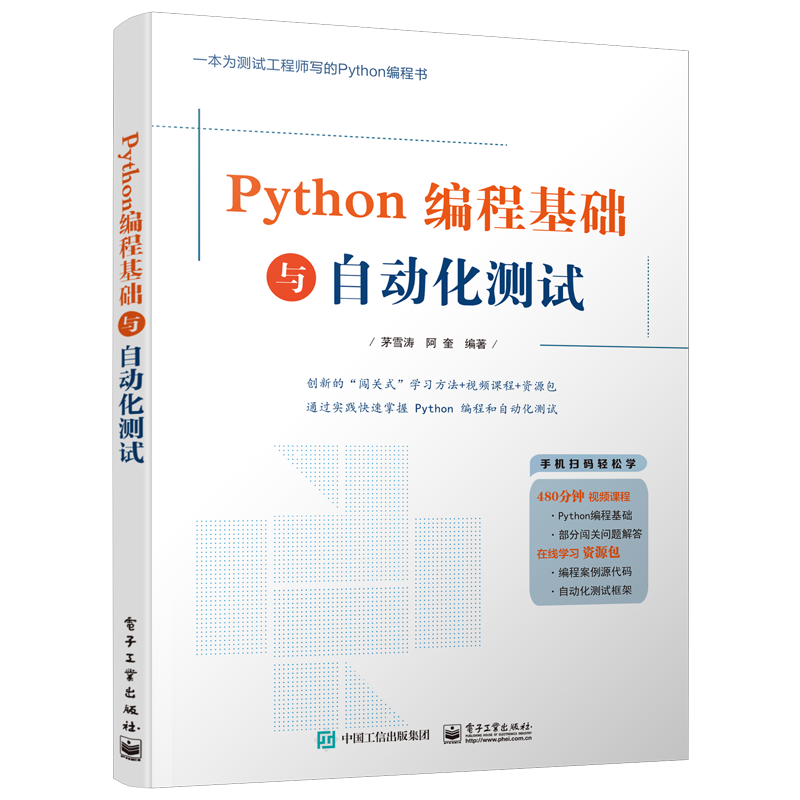

## 欢迎来到Akui的BLOG

### BLOG内容

保存个人工作中的心得体会。

### 工作内容

[《Python编程基础与HTTP接口测试》][realbook]已经由电子工业出版社正式出版上市，可以在天猫、京东等各大线上平台搜索书名，购买！该书致力于通过“闯关式学习”方法，破解很多测试工程师在自我提升的过程中普遍遇到的编程语言学习的难题。其第一部分主要介绍Python语言的快速入门，对于其他领域的从业者快速入门Python也很有帮助。

[《Python编程基础与自动化测试》][realbooknew]是《Python编程基础与HTTP接口测试》的修订版，根据读者意见修订了大量的新内容。

进一步的信息，可以关注我们的微信公众号:IT匠艺教研室

[][realbooknew]

[realbook]: https://search.jd.com/Search?keyword=python%E7%BC%96%E7%A8%8B%E5%9F%BA%E7%A1%80%E4%B8%8Ehttp%E6%8E%A5%E5%8F%A3%E6%B5%8B%E8%AF%95&enc=utf-8&wq=python%E7%BC%96%E7%A8%8B%E5%9F%BA%E7%A1%80%E4%B8%8Ehttp%E6%8E%A5%E5%8F%A3%E6%B5%8B%E8%AF%95

[realbooknew]: https://item.jd.com/13652004.html

### 联系

a_kui at sina.com

